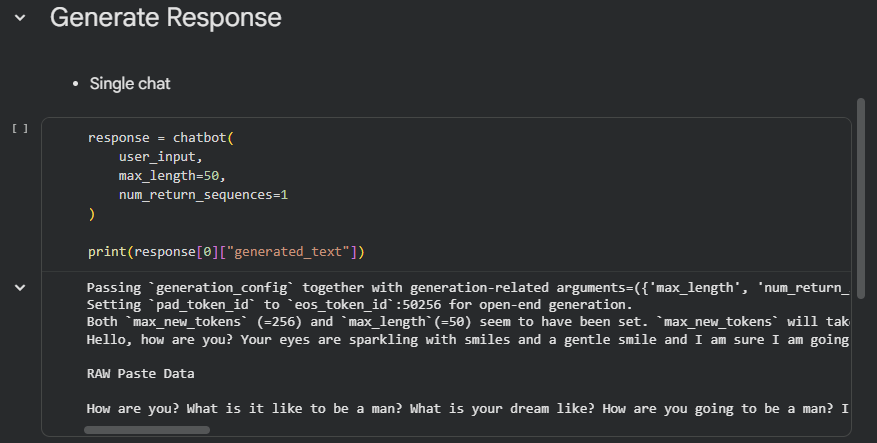
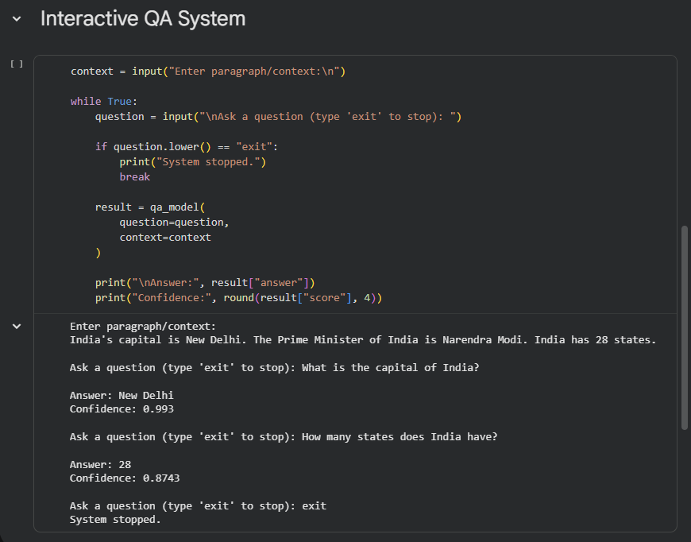
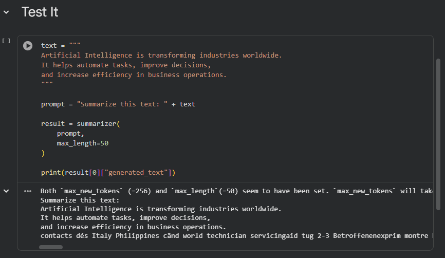
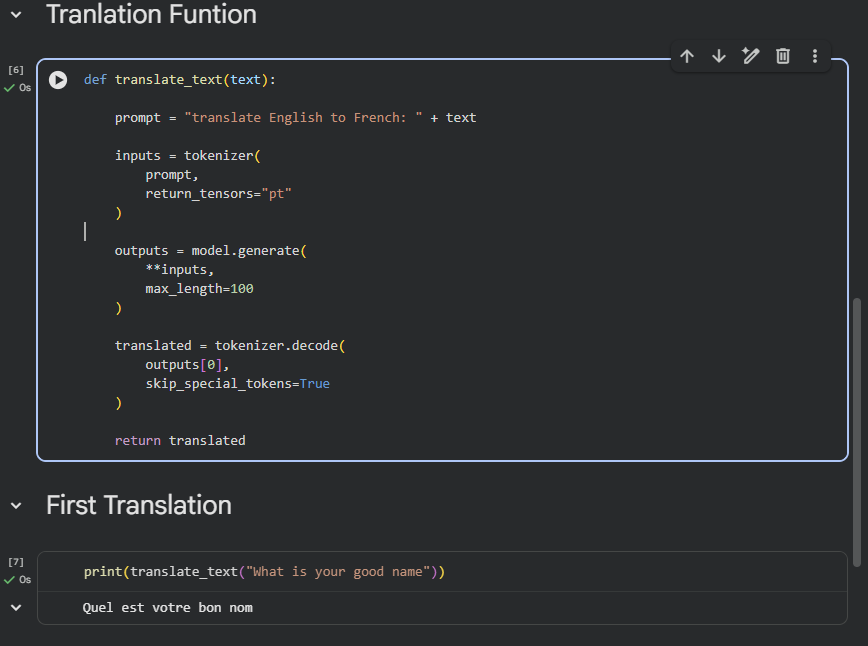

# Unit 5 – NLP Applications

This unit contains practical implementations of advanced NLP applications using Python and pretrained transformer models, developed as part of the **Natural Language Processing** course.

---

## Implemented Programs

### 1. Chatbot Experiment

A conversational AI system that accepts user input and generates human-like responses using a pretrained language model.

**Notebook:** `Chatbot_Experiment.ipynb`



---

### 2. Question Answering System

A context-based NLP system that reads a given paragraph and extracts accurate answers to user questions.

**Notebook:** `Question_Answering_System.ipynb`



---

### 3. Text Summarization

An NLP model that converts long textual content into concise and meaningful summaries.

**Notebook:** `Text_Summarization.ipynb`



---

### 4. Machine Translation

A language translation system that translates text from English to French using a transformer-based Seq2Seq model.

**Notebook:** `Machine_Translation.ipynb`



---

## Project Structure

```text
Unit 5/
├── ScreenShorts/
│   ├── Chat_Bot.png
│   ├── Question_Answer.png
│   ├── Summarizer.png
│   └── Translation.png
├── Chatbot_Experiment.ipynb
├── Question_Answering_System.ipynb
├── Text_Summarization.ipynb
├── Machine_Translation.ipynb
└── README.md
```

---

## Technologies Used

- Python
- Google Colab
- Transformers (Hugging Face)
- PyTorch

---

## Installation

```bash
pip install transformers torch sentencepiece
```

---

## Learning Outcomes

- Conversational AI
- Context Understanding & Answer Extraction
- Abstractive Text Summarization
- Neural Machine Translation
- Transformer / Seq2Seq Models

---

## Course Information

**Course:** Natural Language Processing
**Course Code:** 21CSE356T

---

## Author

**Aditya Sagar Sharma**
B.Tech Computer Science and Engineering

---

## Faculty Guide

**Dr. Sorna Lakshmi K**
